# LHL-Midterm-Project

## Project Goals

There are too many car accidents and far too many lives lost from them.  We believe that advertising the same message to an entire population is not the most effective method for capturing their attention and conveying the critical information that they need to know.  We feel that developing an age-specific approach in advertising is a more impactful strategy. In order to achieve this, we will conduct a thorough analysis of collision data to find specific insights and information, which will further the ability to engage and captivate our target demographics.

Our primary stakeholders are the State Officials responsible for creating the advertising campaigns aimed at reducing collisions. Our objective is to demonstrate the merits of a more age-driven advertising strategy and to create a user friendly, intuitive, and effective dashbaord to gather these age-driven insights.

## Process

1.  Take an exorbitant amount of time searching the world for an interesting dataset.

2.  Extract collision data from DB using SQLite.
    - See File: ["DB_Extraction.ipynb"](https://github.com/loewen-behold/LHL-Midterm-Project/blob/main/notebooks/DB_Extraction.ipynb)

3.  Using Python to conduct a thorough cleaning process and comprehensive exploratory data analysis to become familiar with the data and how it can be leveraged to acheive our goals.
    - See File: ["Collisions_Cleaning_Engineering.ipynb"](https://github.com/loewen-behold/LHL-Midterm-Project/blob/main/notebooks/Collisions_Cleaning_Engineering.ipynb) --> Cleaning, modification, and engineering of tables.  
    - See File: ["EDA_Statistics_ProbabilityCalculations.ipynb"](https://github.com/loewen-behold/LHL-Midterm-Project/blob/main/notebooks/EDA_Statistics_ProbabilityCalculations.ipynb) --> Exploration, Analaysis, Insights used to justify the project goals.

4. Structuring of the data into meaningful arrangements and creating interesting and informative visualizations in order to better convey the importance of the message and give insights on how to reduce the number of collisions by appropriately engaging the specific age groups.  

# Results

Our first objective was to provide enough evidence to justify and convince State Officials that age-specific advertising and collision awareness would be a more effective strategy over generic advertising targeting the entire population. To show this, we needed to prove that there is enough variation in collision data across the various age groups.

When comparing the fatality-to-collision ratios across the different hours of the day, we observed periods that are far more dangerous than others. While the busiest times of the day did translate to more collisions, these were not the times with highest ratio of fatalities per collision. It was actually the least busy driving times that proved to have the highest ratio.

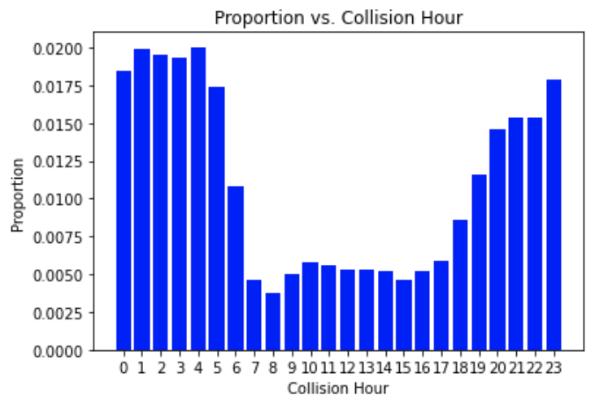
 
 

**Key Take-aways:**
- An accident that occurs in the early hours of the morning (between 1 - 4am) is up to 4x more likely to be fatal than accidents that occur during peak traffic hours (between 3 - 6 pm).
- If the volume of cars on the road nor the frequency of accidents per hour are factors contributing to the above observation, then there must be another underlying cause responsible for the disproportionate rate of fatalities in early morning collisions.

**New Questions that emerge:**
- Could it be the cause of the accident that drives this observation? Is there more speeding, driving under the influence or tired driving happening during this time?
- Could it be that people display different driving habits and practices during these times, such as not wearing a seatbelt, or using their phones?
- Is this observation age specific? Or is this proportionality consistent across age groups?

While exploring whether this is an age specific phenomenon, we found that the general distributions of the ratios of fatalities to collisions were consistent across all age ranges. However, we saw a stark difference in the overall probability of fatalities between these groups.

<table>
  <tr>
    <td>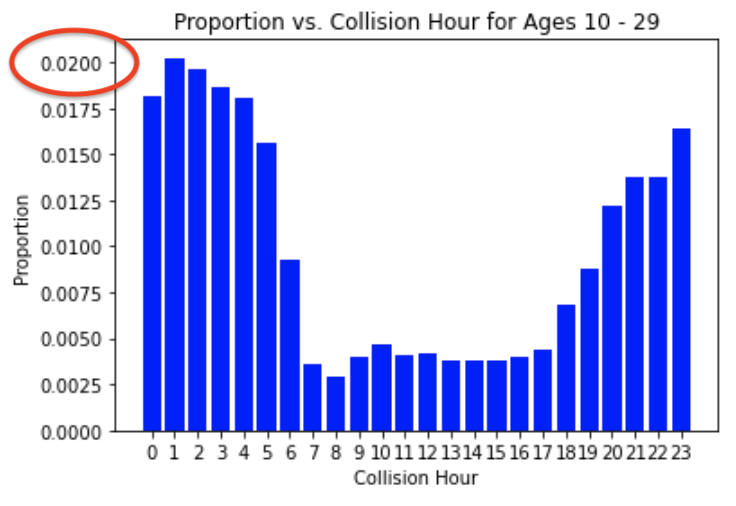</td>
    <td>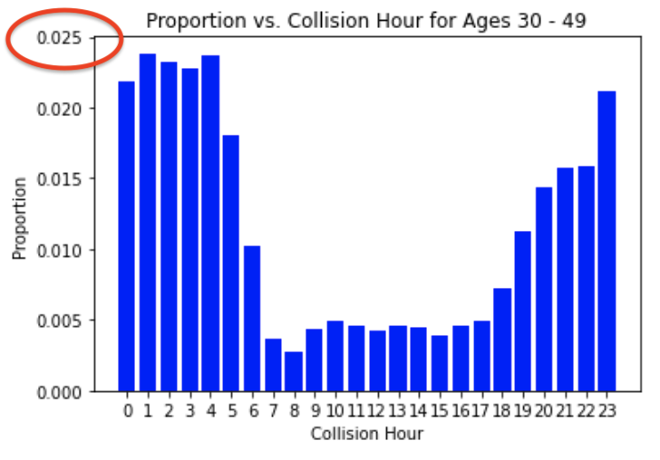</td>
    <td>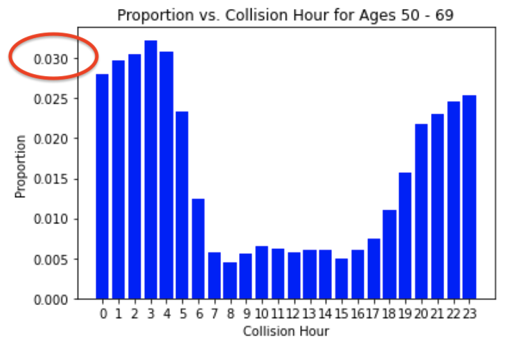</td>
    <td>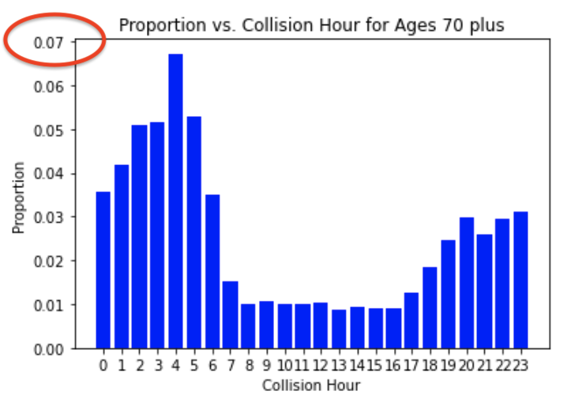</td>
  </tr>
</table>

Taking the average fatality rates for each age group across all hours and comparing the rates to one another, we can see more clearly how the different groups face varying levels of fatality risk.

<table>
  <tr>
    <td>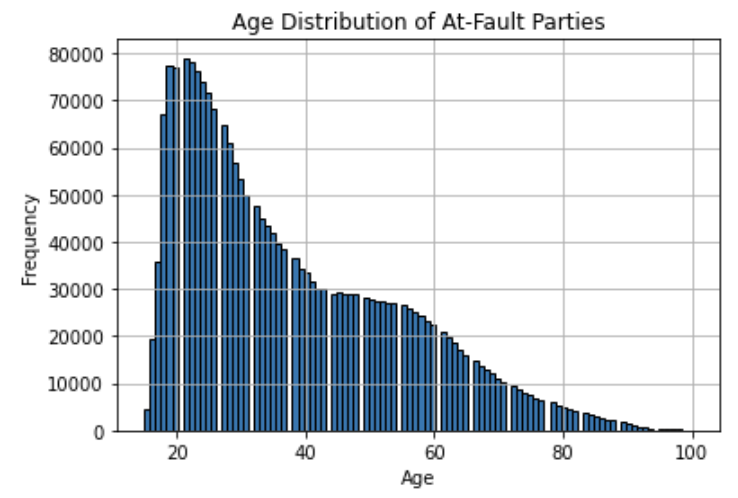
    <td>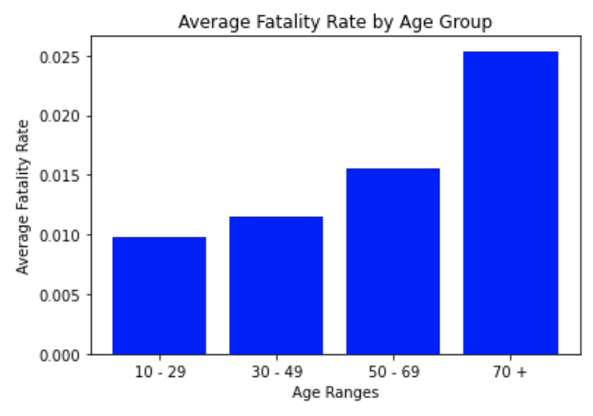
  </tr>
</table>

When looking at the distribution of collisions by age in the chart above, we can see that as the age of the driver increases, the frequency of collisions decreases. This observation might cause one to believe that the most dangerous drivers are between the ages of 15 and 30. However, when we compare this with the average fatality rate within each age group, we see that as individuals grow older, it becomes more likely that their collisions will result in a fatality. Thus, fatality rates and collision numbers by age are inversely proportional. Even though there may be more accidents caused by younger drivers, the severity of the collisions increase as drivers get older.

There may be other factors at play here. It could be something as simple as the older you get, the more frail you get, and thus are more likely to be killed in an accident. However, the underlying issues that cause this observation are likely more complicated than that.

After diving a little deeper into the specific causes of collisions, we found that some were definitively more prevalent amongst different age groups than others. For example, DUIs were more prevalent among ages 20-40, whereas falling asleep behind the wheel was more prevalent among the more aged population.

<table>
  <tr>
    <td>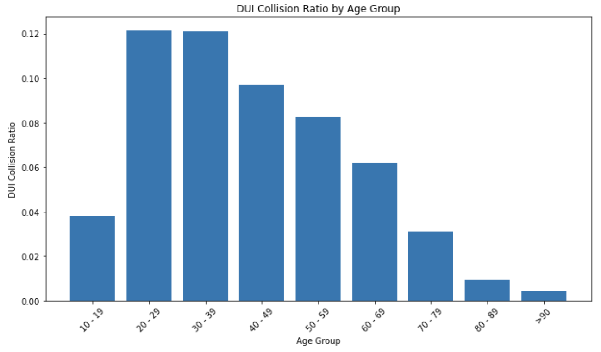
    <td>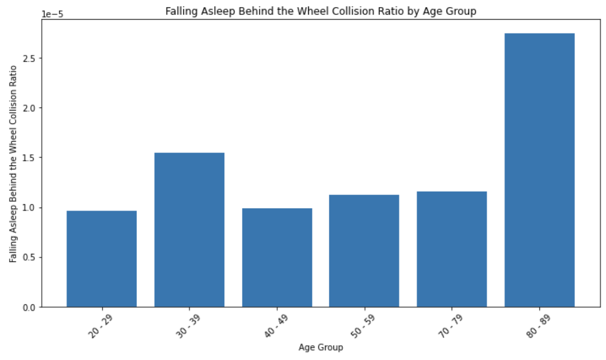
  </tr>
</table>

**Key-Insights:**
- Ages 20-40 are 20% more likely to be driving under the influence than a person in their 40s, 50% more likely to be driving under the influence than a person in their 50s, and 100% more likely to be driving under the influence than a person in their 60s.
- The ratios are fairly even across the age-groups, but we do see a small uptick in drivers between the ages of 30-39, but a major increase (by nearly 3 times) in the 80-89 range.

We conclude that there are certain causes of collisions that are more prevalant for one age group that is not as prevalent for the next.  Thus, when it comes to marketing and advertising campaigns aimed at the public to minimize accidents and associated injuries or fatalities, a one-size-all approach may not be the most effective method. We should instead be tailoring the advertisments to speak directly to the different age-groups in order to capture more people's attention, whereby being more effective in generating awareness of collisions and hopefully encourage better driving habits.

**Next Steps:**

We will use Tableau to create dashboards for our State officials to use and interact with to glean more specific collision details for each age-group.

When considering strategies to enhance the safety of the drivers in all our age groups, it is also important to look at the factors surrounding these collisions in order to identify the most effective ways to reach our target audiences. 

Where are the collisions occuring? Under what conditions? What are the primary causes associated most frequently with each age group?

By guiding the stakeholders to our dashboards, they can access clear and comprehensible visualizations that provide pertinent information at a glance. - See File: ["Collision_Presentation.pdf"](https://github.com/loewen-behold/LHL-Midterm-Project/blob/main/Collision_Presentation.pdf)

Using the interactive map, users have the ability to adjust the slider, advancing through the hours to witness how the primary cause of collisions shift throughout the day. The provided examples offer a glimpse into this dynamic. Majority of accidents across the state at 5pm are caused by speeding, while 6 hours later at, 11pm most collisions can be attributed to driving under the influence.

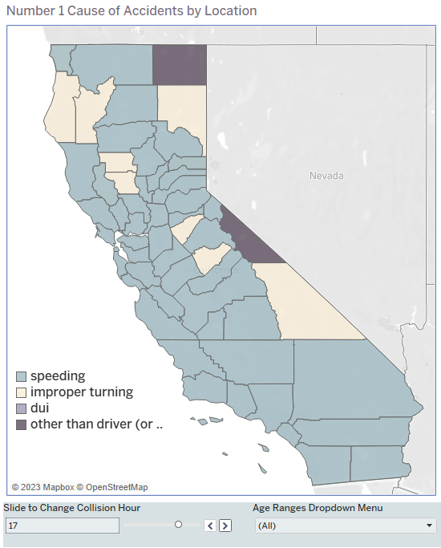 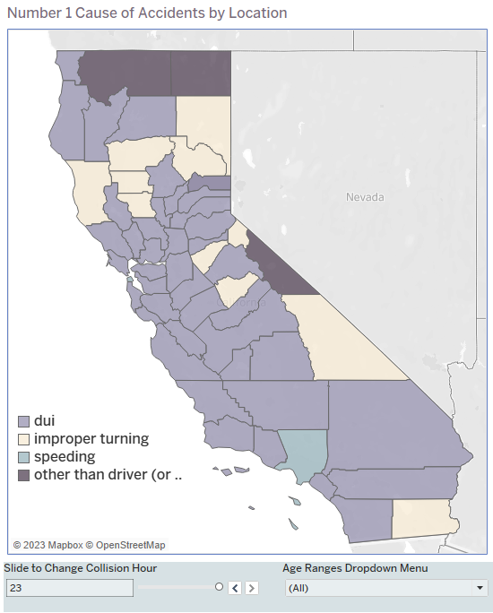

Within this dashboard, it is also possible to select the specific age groups in order to see the age specifc data reflected on the map as well as on the graph comparing the number of injuries to the number of fatalities per hour.

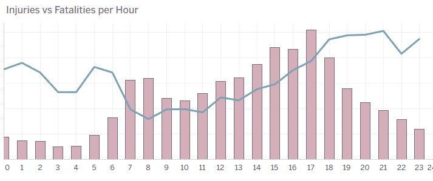

This dashboard is powerful because it can not only show age specific trends, it can inform Officials of what locations are most appropriate to advertise to specific age groups and at what time of the day to advertise for specific causes of collisions.

In another dashboard, we drill down into more specific details surrounding collisions for the various age groups. This visualization includes the top causes observed in that group, the prevelant weather conditions causing fatalities and a comparison of the number of accidents by day of the week, in order to identify which days are the most dangerous. This visualization also provides the liklihood of injury and fatality broken down by the leading causes of collisions for that age group. Furthermore, as an added feature, we provided a parameter than can toggle between genders. It's interesting to see, and not surprising, that even among a specific age group, we sometimes have substantial differences in the collision data for each gender.

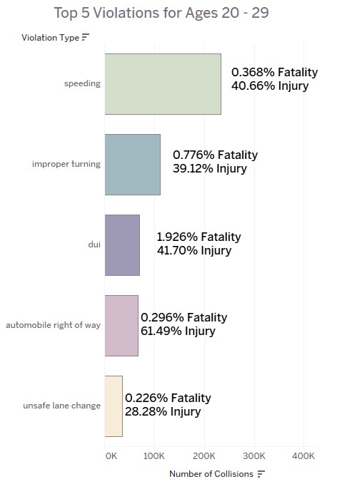 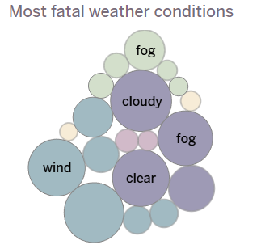 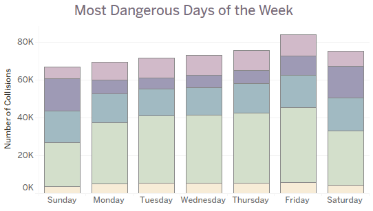 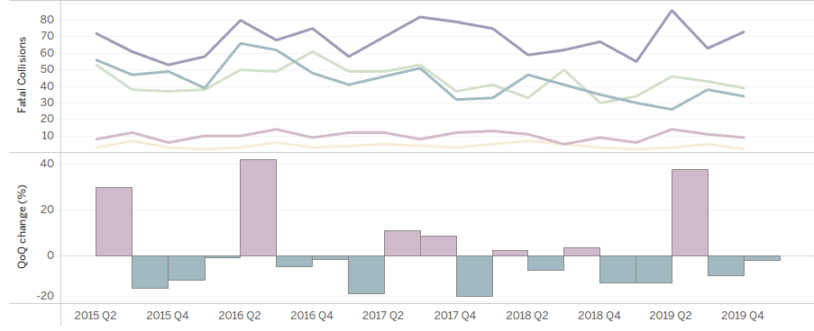

Our Stakeholders can leverage this age-specific data to grab the attention of their intended audience more effectively, and ultimately save more lives.

## Challenges?
- Finding a dataset that was large enough and detailed enough to work with. Our dataset ended up being initially too large for our computers to compute and perform operations on it without a substatial wait time. Determining how to reduce the size of this set, while still maintaining the integrety of the data was difficult.
- Figuring out how to work together on a project in separate places. Keeping track of who's done what and what still needs to be done, and who has updated the files in git most recently (and it's implications) was a challenge - This required consistent and frequent communication between us.
- Github actions via command line is a real struggle. Pushing and pulling and branches and merges can be challenging to navigate.
- A more vague direction and less detailed instructions for this project made it difficult to determine exactly when we were "done".
 
## Future Goals
- Expand the dataset to include more years of data to provide a better image of historical data, and better inform our stakeholders. We need more powerful computing for this.
- Use an even broader data set that including information from other areas.
- Make this more deployable and re-usable for other states or provinces, so more locations can benefit from this resource.